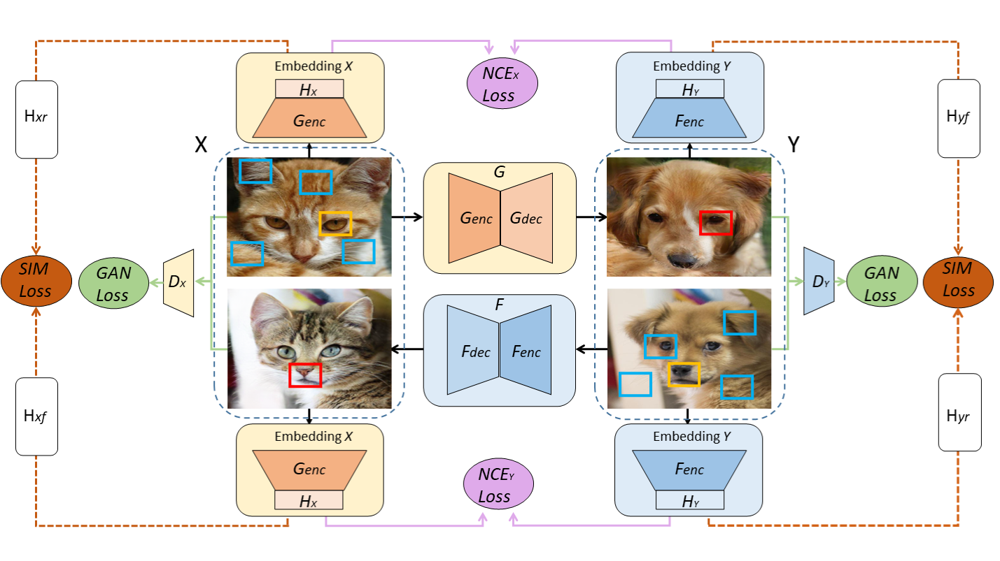

# Dual Contrastive Learning Adversarial Generative Networks (DCLGAN)
This is an implementation of [Dual Contrastive Learning for Unsupervised Image-to-Image Translation](https://arxiv.org/abs/2104.07689) in Tensorflow 2.

DCLGAN is a simple yet powerful model for unsupervised Image-to-image translation. Compared to CycleGAN, DCLGAN performs geometry changes with more realistic results. Compared to CUT, DCLGAN is usually more robust and achieves better performance. A viriant, SimDCL (Similarity DCLGAN) also avoids mode collapse using a new similarity loss.

<div align = 'center'>
  
</div>

## Training
Use `train.py` to train a DCLGAN/SimDCL(Not currently implemented) model on given dataset.
Training takes 502ms(Tensorflow ops) for a single step on RTX 3070 (but ran out of memory).

Example usage for training on horse2zebra-dataset:
```
python train.py --mode dclgan                                   \
                --save_n_epoch 10                             \
                --train_a_dir ./datasets/horse2zebra/trainA \
                --train_b_dir ./datasets/horse2zebra/trainB \
                --test_a_dir ./datasets/horse2zebra/testA   \
                --test_b_dir ./datasets/horse2zebra/testB   \
```


## Inference
Use `inference.py` to translate image from source domain to target domain.

Example usage:
```
python inference.py --mode cut                            \
                    --weights ./output/checkpoints        \
                    --input ./datasets/horse2zebra/testA  \
```


## Requirements
You will need the following to run the above:
- TensorFlow >= 2.0
- Python 3, Numpy 1.19.5, Matplotlib 3.4.3
- If you want to use custom TensorFlow ops:
  - Please refer to the Requirements section of [stylegan2 project](https://github.com/NVlabs/stylegan2).

## Acknowledgements
- The code is developed based on [official-pytorch-implementation](https://github.com/JunlinHan/DCLGAN) and [CUT](https://github.com/cryu854/CUT).
- The training datasets are from [taesung_park/CycleGAN/datasets](https://people.eecs.berkeley.edu/~taesung_park/CycleGAN/datasets/).
- The cuda implementations are from [stylegan2 project](https://github.com/NVlabs/stylegan2).
